# Как я проектировал плату-носитель для ESP32 + E220 + OLED вместе с Codex и ChatGPT

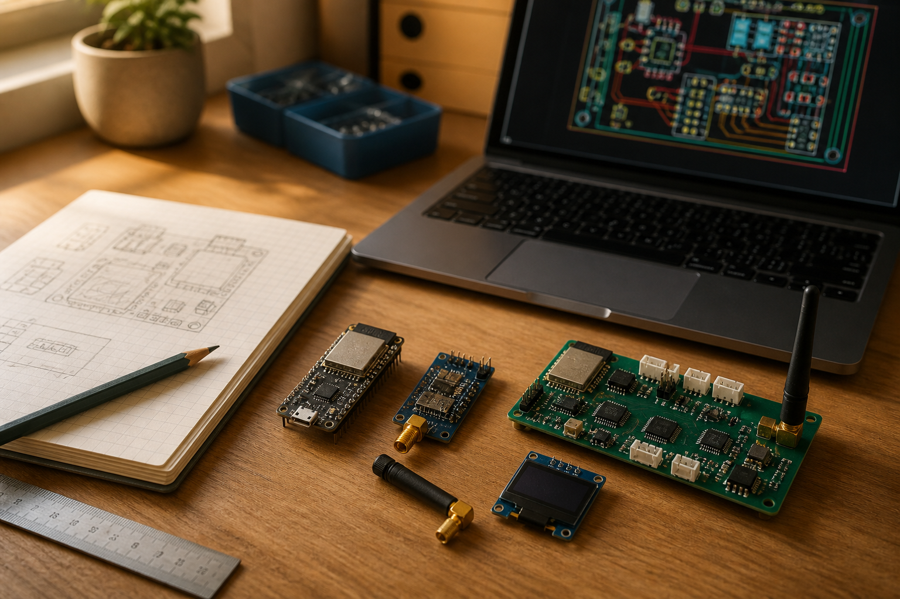

*Обложка — просто редакционная иллюстрация. Реальная плата ниже и выглядит, конечно, менее кинематографично :)*

Вообще эта история началась не с мысли «хочу спроектировать печатную плату».

Идея появилась у меня ещё весной 2025-го, когда я возился со связью для дрона. Архитектура была довольно понятная: на борту ESP32 + E220 получают данные от полётного контроллера, на земле второй E220 + ESP32 принимают их и уже показывают человеку. Наземный узел хотелось сделать с экраном, кнопками и нормальной индикацией.

Первую версию я собрал и спаял вручную из готовых модулей. Примерный софт к тому моменту тоже уже был — то есть это была не абстрактная идея на салфетке, а вполне живой прототип, который доказывал, что связка вообще имеет смысл.

И вот после этого возник закономерный вопрос: **а зачем каждый следующий экземпляр снова собирать проводами, если можно один раз сделать нормальную фабричную плату?**

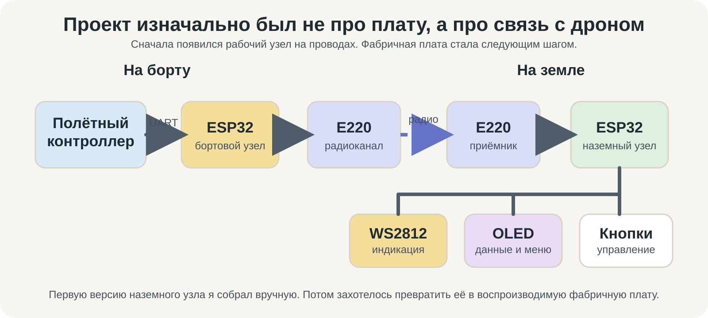

Сразу проектировать обе стороны радиоканала я не стал. Начали с **наземного приёмника**, потому что он заметно сложнее: кроме ESP32 и E220 там есть OLED, кнопки, индикация, питание, сервисные режимы. Бортовой узел в этом смысле проще — ESP32, E220 и UART к полётному контроллеру. Если научимся нормально делать сложную половину, со второй потом будет легче.

Так задача постепенно превратилась из «перепаять рабочий макет аккуратнее» в полноценное проектирование **платы-носителя**: завод собирает питание, защиту, преобразователи, мелкую обвязку и розетки, а готовые ESP32, E220 и OLED я уже сам вставляю после получения платы.

Это было принципиально. Я не хотел намертво припаивать дорогие или легко заменяемые модули. Если E220 сгорит, ESP32 захочется заменить или попадётся другой OLED — меняется модуль, а не вся плата.

На словах всё просто.

На практике проект прошёл примерно такой путь:

**ручной прототип → «сделаем фабричную версию по минималке» → «а давай ещё вот это» → «почему теперь ничего не разводится?» → ошибки → откаты → выбросили лишнее → нашли золотую середину → подготовили производственный пакет.**

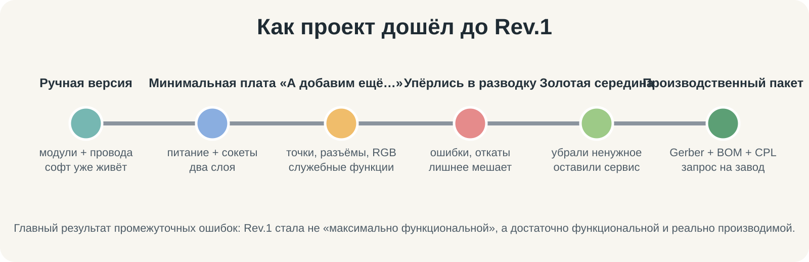

И вот эта часть оказалась интереснее самой платы. Особенно потому, что почти весь путь я проходил вместе с ИИ: **Codex работал руками внутри проекта, а ChatGPT был внешним техническим руководителем и вторым проверяющим, которому я постоянно приносил свежие ZIP-архивы, отчёты и результаты очередного прохода.**

На момент написания поста производственный пакет уже собран и проверен, а в PCBWAVE отправлен запрос на изготовление **5 плат, из которых 4 — с заводской сборкой**. Физических экземпляров пока нет, так что Rev.1 ещё предстоит пройти самый честный тест: включение на столе.

## Что вообще хотелось получить

Базовая архитектура наземного приёмника такая:

- ESP32 DevKit — основной контроллер;
- EBYTE E220 — дальняя радиосвязь;
- OLED 0,96" по I²C;
- внешний 2S Li-ion аккумулятор с BMS, рабочий диапазон примерно 6,0–8,4 В;
- пять кнопок;
- возможность подключить небольшую цепочку WS2812;
- всё это на двухслойной плате, которую можно нормально ремонтировать и собирать без экзотики.

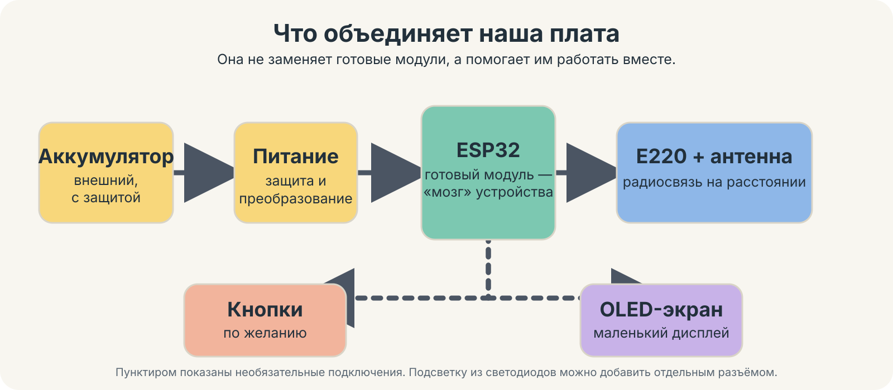

Самое важное решение появилось почти сразу: **ESP32, E220 и OLED остаются съёмными**. На плате-носителе стоят только женские розетки:

- J1/J2 — две Samtec под 30-контактный ESP32 DevKit;
- J3 — Samtec 1×7 под E220;
- J5 — Samtec 1×4 под OLED.

Это потом сильно повлияло и на механику, и на производственную спецификацию: завод должен припаять розетки, но **не должен покупать и устанавливать сами модули**.

## Первый вариант: действительно по минималке

В начале фабричная версия была намного проще того, что получилось в финале.

Нужна была плата, которая соединит три готовых модуля и даст им нормальное питание. Размер зафиксировали **145×90 мм**, два слоя меди. Радиомодуль E220 — к краю, чтобы SMA оставался доступен. ESP32 — тоже антенной наружу, с отдельной зоной, где запрещены медь, дорожки и компоненты.

Питание: 2S аккумулятор → преобразователь → 5 В. Без зарядки на самой плате, без балансировки и без попытки запихнуть в Rev.1 вообще всё устройство целиком.

И на этом этапе проект выглядел вполне цивилизованно: около **33 посадочных мест, 81 дорожки, 17 переходных отверстий и двух зон заливки меди**.

Можно было бы, наверное, на этом остановиться.

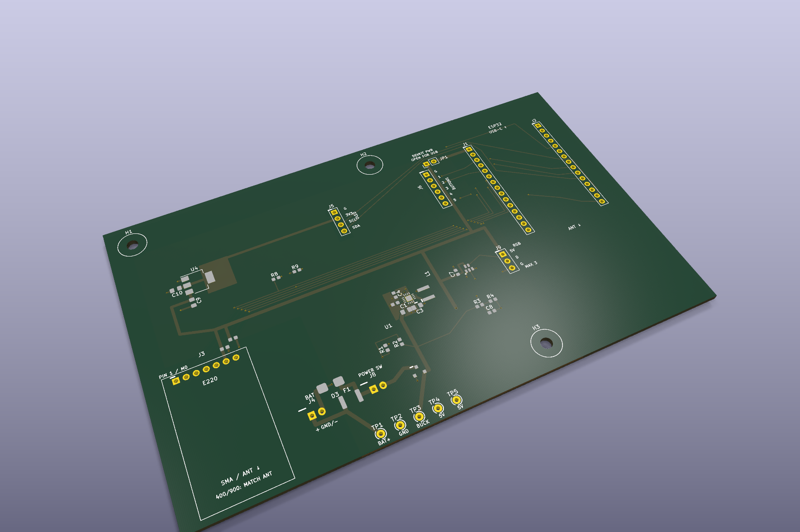

*3D-визуализация полезна не только для красоты. До заказа на ней хорошо видно, куда упрётся модуль, будет ли доступен разъём и не окажется ли антенна внутри платы.*

Но тогда проект был бы не мой :)

## Потом, конечно, понеслось

По ходу обсуждения стали всплывать вещи, которые хотелось иметь не «когда-нибудь», а сразу:

- нормальный внешний выключатель питания;
- защита от переполюсовки;
- TVS-диод на входе;
- самовосстанавливающийся предохранитель;
- измерение напряжения аккумулятора через АЦП ESP32;
- отдельное питание 3,3 В для OLED, чтобы не надеяться на неизвестный запас регулятора конкретного DevKit;
- сервисная перемычка, позволяющая изолировать VIN ESP32 при работе через USB;
- кнопки;
- RGB-индикация;
- дополнительные контрольные точки;
- дополнительные выводы «на всякий случай».

В какой-то момент появились даже отдельный `DISPLAY_AUX`, целая группа контрольных точек для сигналов E220 и встроенный WS2812 прямо на плате.

То есть классическое: **«место вроде есть, давайте добавим»**.

Именно здесь двухслойная плата начала объяснять, что свободное место на картинке и место для нормальной разводки — это две очень разные вещи.

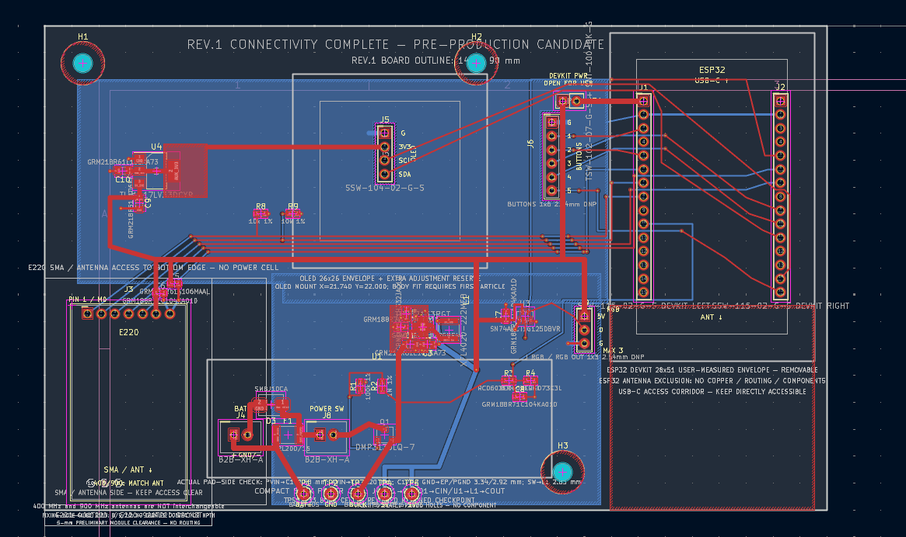

*Это рабочий экран KiCad. Длинные подписи находятся на инженерных слоях и в Gerber для шелкографии не уходят.*

## Первая серьёзная стена — разводка E220

Между ESP32 и E220 нужно было провести пять обязательных сигналов:

- M0;
- M1;
- AUX;
- RXD;
- TXD.

При этом M0/M1 ещё имеют локальные резисторы подтяжки к земле. А рядом мы успели навесить дополнительные контрольные точки.

Каждый кусок по отдельности выглядел безобидно. Но когда агент-планировщик трассировки попытался доказать все маршруты одновременно, вариант с дополнительной группой контрольных точек дал **25 нарушений правил разводки (DRC)**.

И это был полезный момент: вместо того чтобы начать проталкивать дорожки любой ценой, мы признали, что архитектура стала хуже ради функций, которыми я, скорее всего, никогда не воспользуюсь.

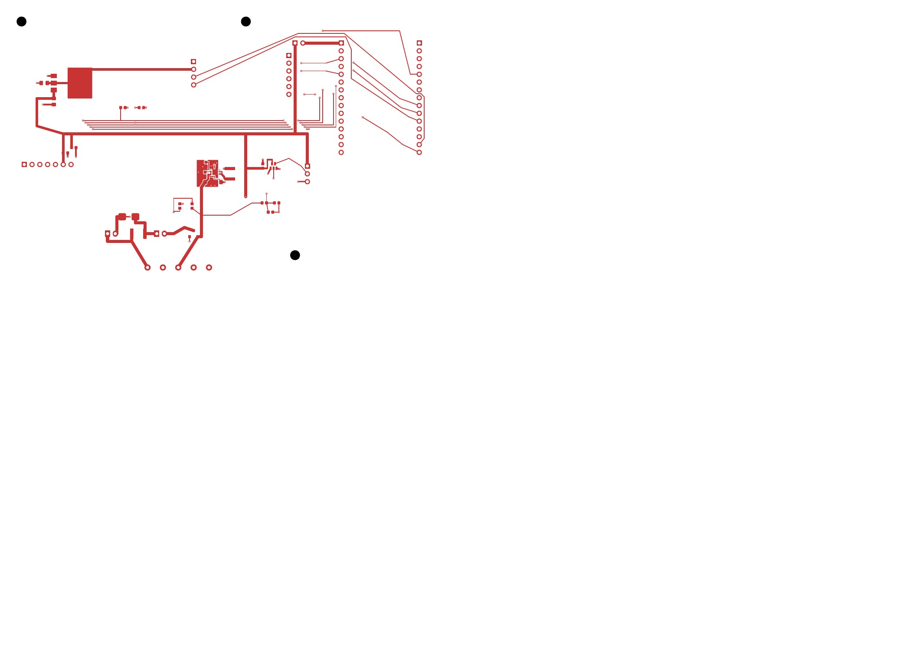

*Отдельный медный слой выглядит странно и местами пусто без остальных слоёв — это нормально. Здесь важны реальные маршруты, а не красота картинки.*

Так появились первые ножницы.

Мы убрали:

- J7 `DISPLAY_AUX`;
- TP6…TP10 для сигналов E220;
- встроенный D2 WS2812.

Но оставили:

- J6 — пять кнопок;
- J9 — внешний RGB-разъём;
- TP1…TP5 для реально полезных измерений питания;
- `BAT_SENSE`;
- J8 `POWER SW`;
- JP1 `DEVKIT_PWR`.

Это и стало той самой **золотой серединой**: плата перестала пытаться быть универсальной отладочной платой на все случаи жизни, но всё, что реально понадобится в устройстве или при ремонте, осталось.

И, пожалуй, это главный архитектурный результат всей истории. Первая мысль обычно была «раз уж делаем плату, надо предусмотреть всё». После нескольких неудачных проходов стало понятно, что лучше сделать **меньше функций, но каждую нормально**.

## С питанием пришлось повозиться больше всего

Финальная цепочка питания получилась такой:

**J4 BAT → F1 → BAT_FUSED → J8 внешний выключатель → BAT_SW → Q1 защита от переполюсовки → TPS62133 → 5V_SYS.**

Параллельно на входе стоит TVS-диод. Для ESP32 5 В идут через сервисную перемычку JP1 на отдельную сеть `DEVKIT_VIN`.

Для OLED добавился отдельный **TLV1117LV33**, который делает `AUX_3V3`.

Почему не запитать экран просто от 3,3 В DevKit? Потому что ESP32 DevKit — штука не очень стандартизированная. Регулятор на одной плате может спокойно тянуть дополнительную нагрузку, на другой — уже работать на грани. Мне хотелось, чтобы плата не зависела от того, какой именно клон ESP32 я вставил.

Финальный расчётный бюджет `5V_SYS` получился около **0,99 А уже с запасом**, при том что TPS62133 рассчитан на ток до 3 А. То есть запас по питанию получился комфортный.

Для контроля аккумулятора на GPIO32 стоит делитель 10 кОм / 3,3 кОм и конденсатор. При 6,0–8,4 В батареи АЦП видит примерно 1,49–2,08 В.

### И здесь ИИ тоже успел переусложнить

Когда мы добавили отдельный 3,3-вольтовый регулятор U4, сначала расчёт шёл из старого предположения о нагрузке около 300 мА. В результате появился огромный для этой платы тепловой остров меди примерно **20×22 мм** плюс идея активно использовать нижний слой.

Позже финальная нагрузка `AUX_3V3` стала всего около 100 мА. Мы пересчитали U4 по документации TI: рассеивание получилось около **0,17 Вт**, оценочный подъём температуры — порядка 11 °C на эталонной плате TI.

Проверяющий агент справедливо завернул старый вариант как бессмысленно раздутый. В итоге осталось аккуратное локальное пятно **8×10 мм на верхнем медном слое (`F.Cu`)**, без отдельного теплового острова на нижнем слое (`B.Cu`) и без массива переходных отверстий.

Это хороший пример того, почему ИИ нельзя давать задачу в стиле «сделай максимально надёжно». Он с удовольствием сделает. Иногда настолько надёжно, что потом полплаты придётся отдать под надёжность :)

## Как на самом деле была устроена работа с ИИ

Вот тут самое интересное.

Я не писал в ChatGPT: «нарисуй мне плату» — и не получал волшебный Gerber через пять минут.

Наоборот, чем дальше шёл проект, тем меньше я просил ИИ «сделать всё» и тем сильнее дробил работу на маленькие проверяемые шаги.

Работа была разделена на два контура.

### Codex — руки внутри репозитория

Codex CLI работал непосредственно с проектом: правил KiCad-файлы и генераторы, запускал проверки, строил временные варианты, сохранял материалы проверки и формировал отчёты.

Я завёл несколько специализированных агентов:

- `pcb_engineer` — электрическая часть;
- `pcb_routing_planner` — заранее доказывает, что требуемые дорожки вообще можно провести;
- `pcb_layout_dfm` — физическая реализация и проверка технологичности;
- `pcb_evidence_auditor` — сверка критичных решений с документацией производителей;
- `pcb_reviewer` — независимый критик после изменения.

Инженерные роли и роли по разводке у меня в текущей конфигурации работали на GPT-5.6 Sol, а проверяющий агент и аудитор — на GPT-5.6 Terra. Не потому что одна модель «умная», а другая «злая». Идея проще: **тот, кто сделал изменение, не должен единолично решать, что оно хорошее**.

У агентов был довольно жёсткий порядок работы. Например, для физического изменения:

**планировщик трассировки → проверка плана → реализация → независимая проверка результата.**

Причём экспериментировать на основной версии платы агентам в итоге вообще запретили. Сначала временная копия, потом проверки, и только затем изменение рабочей платы.

### ChatGPT — внешний контур и память проекта

Параллельно у меня всё время был отдельный длинный диалог с ChatGPT (GPT-5.6 Sol).

Я приносил туда:

- результаты очередного запуска Codex;
- свежие ZIP-архивы проекта KiCad;
- снимки экрана;
- отчёты ERC/DRC;
- промежуточные и финальные производственные архивы с Gerber-файлами, файлами сверловки, спецификацией и координатами установки компонентов.

ChatGPT в этой схеме был чем-то между техническим руководителем, вторым проверяющим и переводчиком с «языка отчётов Codex» на нормальный человеческий.

Например, Codex однажды вернул: «осталось восемь несоединённых цепей, но они отложены и не обязательны». Формально проверка была зелёной.

Я принёс результат сюда. ChatGPT посмотрел реальную плату и выяснил, что две линии OLED вообще нельзя считать необязательными, а `R2.1 BUCK_IN` — это часть цепи затвор–исток Q1, которую тоже обязательно надо соединить.

После этого следующий шаг был уже не «попробуй закончить разводку», а очень узкое задание для Codex: **сделать только конкретные соединения, не трогать принятую геометрию, сначала доказать решение на временной копии, после каждого шага запускать DRC, а при первой неожиданной ошибке — откатить именно этот шаг и остановиться.**

В другой итерации ChatGPT по свежему ZIP увидел, что для U4 оба физических контакта с номером 2 должны быть на одной сети, а один из них остался без сети. Визуально посадочное место выглядело нормально, но формально это был реальный дефект.

Ещё один важный момент — ChatGPT держал историю решений. Это оказалось полезнее, чем кажется. Когда проект живёт много итераций, модель легко может начать чинить старую проблему, которая уже перестала существовать, или вернуть функцию, которую мы сознательно удалили. Внешний диалог помогал постоянно сверять: **мы сейчас действительно исправляем актуальную проблему или случайно откатываемся на три шага назад?**

В итоге связка выглядела так:

**я принимаю решения → ChatGPT помогает разобрать ситуацию и ограничить следующий шаг → Codex делает изменение в репозитории → отдельный агент пытается его сломать → формальные проверки решают, можно ли двигаться дальше.**

Для меня это гораздо интереснее, чем история «нейросеть сама нарисовала плату».

## Почему я перестал доверять фразе «всё прошло»

Потому что языковая модель очень хорошо умеет написать убедительный отчёт о собственной работе.

Это не значит, что она врёт. Она просто может не заметить проблему, неправильно истолковать результат инструмента или уверенно считать какое-то допущение допустимым.

Поэтому постепенно мы обложили проект проверками, которые вообще не зависят от мнения модели.

Появился `hardware/check_board_contract.py`. Он проверяет вещи вроде:

- ровно два медных слоя;
- контур 145×90 мм;
- ожидаемое количество и состав посадочных мест;
- согласованность дублирующихся контактных площадок и их цепей;
- отсутствие случайных площадок без сети;
- реальную зону запрета вокруг антенны ESP32;
- защищённую геометрию критического узла преобразователя питания;
- некоторые обязательные особенности готовой платы.

Отдельно проверяется соответствие схемы и печатной платы, запускаются встроенные ERC/DRC KiCad и проверка производственных метаданных.

Это сильно изменило стиль работы с Codex. Я больше не просил «поправь плату и скажи, что получилось». Задача стала выглядеть примерно так:

1. Сделай копию во временной директории.
2. Докажи изменение там.
3. Прогони проверку контракта платы, DRC и соответствие схеме.
4. Отдай результат независимому проверяющему агенту.
5. Только после успешной проверки меняй рабочую версию платы.
6. После каждой маленькой операции снова запускай проверки.
7. Если появилось что-то неожиданное — откати именно эту операцию и остановись.

Однажды это спасло проект буквально в том виде, как задумано: попытка соединить три оставшиеся группы GND полезла через район `/SS_TR`, получила конфликт и была **откачена байт в байт**. Следующий проход уже решил землю локальными переходными отверстиями и короткими участками нижнего слоя.

ИИ от этого не стал меньше ошибаться. Просто его ошибки перестали автоматически превращаться в состояние проекта.

## Несколько ошибок, которые реально поймали по дороге

Их было достаточно, чтобы перестать верить в концепцию «ну почти готово».

### U4 и два контакта с одним номером

В одном отклонённом варианте у TLV1117LV было два физических контакта №2: большая теплоотводная площадка сидела на `AUX_3V3`, а маленькая контактная площадка №2 осталась без сети.

Визуально посадочное место выглядело вполне нормально. Электрически — нет.

После этого согласованность дублирующихся площадок стала отдельной проверкой контракта платы.

### Антенна ESP32

Сначала зона запрета вокруг антенны была фактически только нашей договорённостью и графикой на инженерном слое. Потом мы сделали её настоящей областью ограничений KiCad и добавили проверку в скрипт.

Потому что фраза «агент помнит, что туда нельзя класть медь» — не инженерное ограничение.

### U3 SN74AHCT1G125

Уже на предпроизводственной проверке выяснилось, что временное посадочное место U3 имело контактные площадки **0,60×0,80 мм**, а в официальной документации TI для корпуса DBV приведены площадки **0,60×1,10 мм** при тех же центрах.

DRC на такую вещь, разумеется, не ругался: дорожки соединены, зазоры правильные. Просто посадочное место не было нормально закрыто по документации производителя.

Мы остановили выпуск, переделали посадочное место по TI, сдвинули только пять локальных концов дорожек на 0,25 мм, снова прогнали все проверки — и лишь потом продолжили.

### Старые отчёты тоже оказались опасными

В проекте некоторое время лежал старый `drc.rpt`, который рассказывал про десятки несоединённых цепей и давно удалённые D2/TP6…TP10.

Для человека понятно: файл старый.

Для агента, который пришёл в новый контекст, это вполне может стать «истиной проекта».

Поэтому перед выпуском мы отдельно вычистили устаревшую документацию и стали заново формировать актуальные отчёты ERC/DRC и соответствия схемы плате.

То есть чистота проекта оказалась важна не только ради человека, но и ради ИИ. Если в репозитории лежат две противоречащие друг другу версии правды, модель вполне может выбрать не ту.

## Самая забавная проверка пришла уже не от ИИ

Когда производственный пакет был практически готов, я просто посмотрел на плату глазами человека, который потом будет её паять.

И заметил: J6 для кнопок и J9 для внешнего WS2812 я специально оставил без гребёнок, чтобы самому потом впаять провода. А вокруг отверстий снизу лежит большая заливка GND.

Электрически всё прекрасно. Паяльная маска защищает медь, DRC — ноль.

Но если когда-нибудь руками просовывать провод, перегреть площадку или сделать большую каплю припоя, мне просто **не хотелось иметь огромную землю прямо вокруг пользовательских отверстий**.

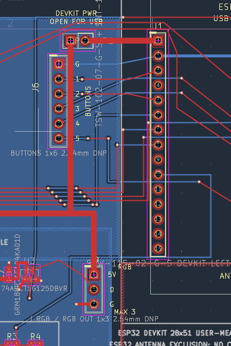

*Снимок из процесса до финальной сервисной правки.*

В результате вокруг J6 и J9 сделали локальные области на нижнем слое (`B.Cu`), которые запрещают только заливку меди. Земля к каждому разъёму приходит отдельной дорожкой 0,8 мм.

Потом по той же логике сделали маленькое окно вокруг J5 OLED — не под всем экраном, а только вокруг четырёхконтактной розетки, чтобы её было проще когда-нибудь перепаять.

Основную землю при этом не порезали на куски.

Вот это для меня хороший пример границы автоматической проверки: **DRC может сказать, что плата правильная. Он не скажет, что мне через год будет неприятно держать паяльник в конкретном месте.**

## С землёй E220, наоборот, ничего резать не стали

У радио локальные C5/C6 и контакт GND разъёма J3 образуют короткий возврат к общей земле. Когда я отдельно посмотрел на этот кусок, сначала он показался подозрительным — слишком много земли в маленьком месте.

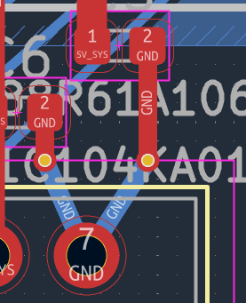

Но тут как раз всё наоборот: это не пользовательский разъём для ручной пайки, а заводская розетка радио. Короткий локальный возврат питания для E220 полезен, поэтому его оставили.

То есть даже одинаково выглядящие участки платы нельзя чинить одним правилом «давайте везде уберём полигон».

## Механика тоже пришла в самом конце

Ещё одна вещь, которую мы почти забыли: как эту плату вообще прикрутить к корпусу.

Изначально крепёжные отверстия отложили до корпуса, чтобы не сверлить плату наугад. Потом я понял, что три точки крепления мне всё-таки нужны уже в Rev.1: сначала плата-носитель прикручивается к стойкам, потом сверху вставляются ESP32/E220/OLED.

В финал добавили три отверстия:

- H1 — (7, 7) мм;
- H2 — (80, 7) мм;
- H3 — (96, 83) мм.

Все **Ø3,2 мм, неметаллизированные**, без электрической связи с GND. Вокруг каждого — область Ø8 мм без меди, дорожек и переходных отверстий, чтобы металлическая стойка или шайба ни с чем случайно не контактировала.

Отверстие около антенны E220 специально не делали, а H3 оставили слева от зоны запрета вокруг антенны ESP32.

## Что получилось в финале

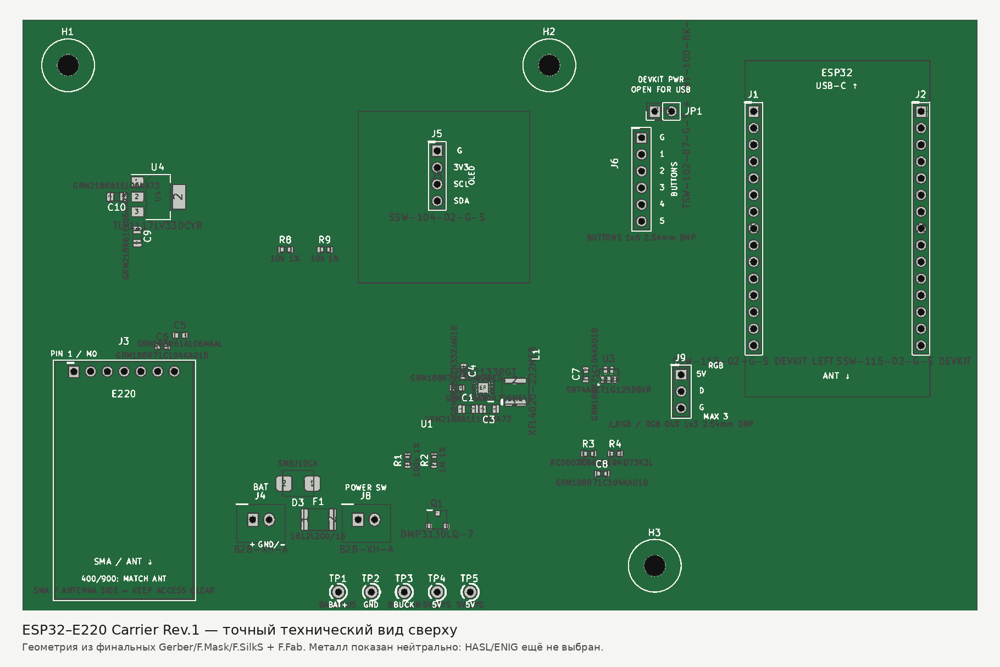

*Это не художественная картинка. Геометрия собрана из финальных Gerber, слоёв паяльной маски, шелкографии и сборочного чертежа.*

Финальная Rev.1:

| Параметр | Значение |
|---|---:|
| Размер | 145×90 мм |
| Медных слоёв | 2 |
| Посадочных мест | 40 |
| Дорожек | 202 |
| Переходных отверстий | 58 |
| Зон заливки меди | 4 |
| Областей ограничений | 7 |
| Металлизированных отверстий | 119 |
| Неметаллизированных крепёжных отверстий | 3× Ø3,2 мм |
| Нарушений DRC | 0 |
| Несоединённых цепей | 0 |
| ERC | 0 ошибок / 0 предупреждений |

На нижнем слое большая часть платы остаётся сплошной землёй, но уже с локальными сервисными окнами там, где это действительно полезно.

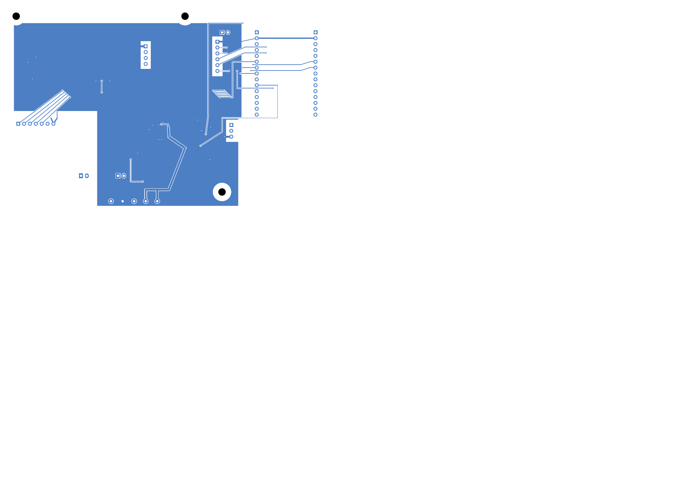

Съёмными остаются:

- ESP32 DevKit;
- E220;
- OLED.

Завод устанавливает женские розетки для этих модулей и всю силовую/сигнальную обвязку.

J6 `BUTTONS` и J9 `RGB` приезжают просто как металлизированные отверстия — без гребёнок. TP1…TP5 — тоже только отверстия для щупа.

RGB в итоге оставили внешним: на плате есть SN74AHCT1G125, который переводит 3,3-вольтовый сигнал данных ESP32 в 5 В, а наружу выходит J9: 5V / DATA / GND. Для Rev.1 ограничили использование максимум тремя светодиодами WS2812.

## Как выглядит выпуск производственных файлов с ИИ

После того как схема и разводка стали зелёными, работа не закончилась.

Мы отдельно проверяли уже не KiCad-проект, а **то, что реально увидит завод**:

- Gerber-файлы всех нужных слоёв;
- контур `Edge.Cuts`;
- файлы сверловки Excellon для металлизированных и неметаллизированных отверстий;
- IPC-356;
- спецификацию компонентов (BOM);
- файл координат установки SMD-компонентов (CPL);
- отдельный перечень выводных компонентов;
- список того, что завод устанавливать не должен;
- ориентацию разъёмов;
- контрольные суммы всех файлов внутри итогового ZIP-архива.

И тут тоже появилась полезная дисциплина: этап формирования производственного пакета **вообще не имел права менять плату**. Если во время генерации файлов обнаруживается ошибка конструкции — стоп, возвращаемся на отдельный этап изменения проекта. Никаких «я тут заодно поправил посадочное место и пересобрал Gerber».

Финальный архив для завода прошёл отдельную проверку без права что-либо менять и сверку контрольных сумм.

После этого я уже вручную проверял форму PCBWAVE: 2 слоя, 145×90 мм, толщина 1,6 мм, медь 35 мкм (1 oz), чёрная маска, белая шелкография, бессвинцовый HASL. Запросил 5 плат, из них 4 — с заводской сборкой.

Для PCBWAVE отдельно пришлось очень явно написать:

- J1/J2/J3/J5 — **установить женские розетки**;
- ESP32/E220/OLED — **не покупать и не устанавливать**;
- J6/J9 — оставить пустыми;
- TP1…TP5 — никаких штырей или стоек, только металлизированные отверстия;
- H1/H2/H3 — именно неметаллизированные отверстия Ø3,2 мм;
- любые замены компонентов с жёстко заданным артикулом производителя сначала согласовать со мной.

Потому что хороший производственный пакет — это не только правильные дорожки. Это ещё и отсутствие возможности у сборщика **правильно выполнить неправильно сформулированное задание**.

## Что я понял про проектирование с ИИ

До этого проекта у меня был довольно очевидный сценарий использования ИИ в разработке: спросить, получить ответ, поправить код, поехать дальше.

С железом так не работает.

Если агент ошибся в PHP — откатил изменение в Git и пошёл дальше. Если агент ошибся в посадочном месте компонента, а ты уже заказал пять собранных плат — у тебя появляется очень материальное напоминание о цене доверия к языковой модели.

Поэтому самое полезное, что получилось здесь, — даже не конкретная плата, а рабочая схема взаимодействия.

**ИИ хорошо предлагает и реализует варианты. Формальные инструменты проверяют, соответствуют ли они правилам. Человек решает, что вообще имеет смысл делать.**

Codex оказался очень хорош именно как исполнитель в ограниченном коридоре: «вот один узел, вот разрешённые изменения, вот проверки, вот условие остановки».

Когда же задача звучала слишком широко — например, «сделай надёжнее» или «добавь всё полезное» — начиналось переусложнение. Именно так мы получили лишние контрольные точки, лишние разъёмы и слишком большую тепловую область U4.

ChatGPT оказался полезнее всего не тогда, когда давал готовые ответы, а когда я приносил очередной отчёт или архив и спрашивал: **«они сейчас что сделали и можно ли идти дальше?»**

В этой роли он:

- держал длинную историю принятых и отменённых решений;
- сравнивал новую итерацию с предыдущей;
- замечал, когда старое допущение уже неактуально;
- разбирал реальные KiCad-архивы, а не только красивый текст отчёта;
- помогал превращать следующую работу Codex в узкую техническую задачу;
- периодически говорил «нет, сейчас дальше идти нельзя», даже когда формально часть проверок уже была зелёной.

А я по ходу дела несколько раз ловил то, чего не ловили ни агенты, ни DRC: те же зоны земли у отверстий для ручной пайки или забытые крепёжные отверстия.

То есть получилось не «ИИ спроектировал плату».

Получилось скорее так:

**я + ChatGPT + Codex + KiCad + документация производителей + автоматические проверки + несколько весьма полезных неудачных итераций спроектировали Rev.1.**

И мне такой вариант нравится гораздо больше.

Наверное, главный вывод здесь вообще не про электронику. ИИ в инженерной задаче оказался полезен не как волшебный эксперт, которому можно отдать ответственность, а как очень быстрый участник команды. Он может считать, искать, сравнивать, писать скрипты, менять проект, предлагать маршрут, готовить документацию. Но если убрать ограничения, независимую проверку и человека, который помнит, зачем всё это делается, скорость легко превращается в скорость движения не туда.

## Что дальше

Сейчас запрос на изготовление и сборку уже отправлен PCBWAVE. Дальше будет самое интересное:

1. получить окончательную котировку и проверить все предложенные замены компонентов;
2. заказать платы;
3. проверить питание без установленных модулей;
4. проверить `5V_SYS` и `AUX_3V3`;
5. вставить ESP32 и проверить работу через USB и сервисный режим;
6. подключить E220 и посмотреть связь;
7. проверить OLED;
8. нагрузить питание и измерить температуру U1/U4;
9. проверить `BAT_SENSE`;
10. уже потом заниматься корпусом и реальной эксплуатацией.

Я специально не хочу заканчивать этот пост словами «всё работает идеально», потому что физической платы на столе пока нет.

Пока у нас есть другое: **проект, который дошёл от ручной версии на проводах до производственного пакета с нулевым DRC, понятной спецификацией и конкретным запросом на завод.**

Для первой фабричной ревизии — уже неплохо.

А если она с первого включения ещё и заработает — будет вообще подозрительно :)

---

### Подписи к материалам

* `00-ot-drona-k-priemniku.svg` — схема исходной идеи: бортовой передатчик и наземный приёмник.
* `01-oblozhka-protsess.png` — сгенерированная редакционная иллюстрация для обложки; не фотография проекта.
* `02-realnaya-plata-3d.png` — 3D-визуализация платы из KiCad.
* `03-dorozhki-verhniy-sloy.png` — экспорт верхнего медного слоя.
* `04-put-signala.svg` — упрощённая функциональная схема наземной платы.
* `05-final-top-technical.png` — точный технический вид финальной платы сверху.
* `06-kicad-final-workspace.png` — рабочий снимок экрана KiCad одной из поздних итераций.
* `07-j6-ground-discussion.png` — фрагмент J6, из-за которого появились локальные зоны без заливки меди.
* `08-e220-ground-fragment.png` — локальная земля E220; пример участка, который специально не стали «улучшать».
* `09-final-bcu-production.png` — визуализация финального нижнего медного слоя.
* `10-evolyutsiya-proekta.svg` — схема эволюции проекта от ручного прототипа до производственного пакета.
