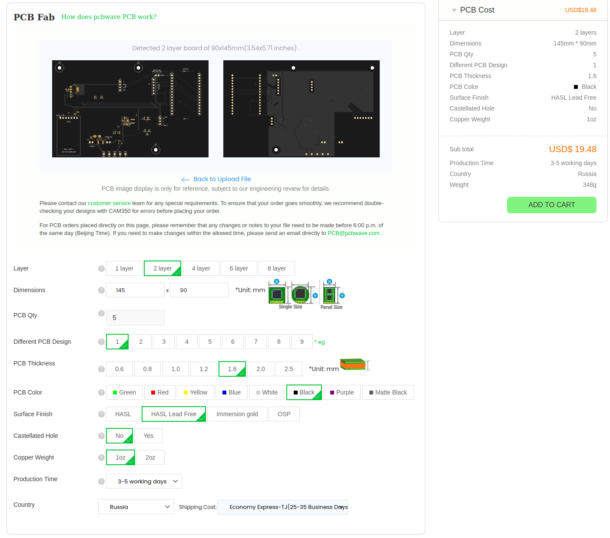
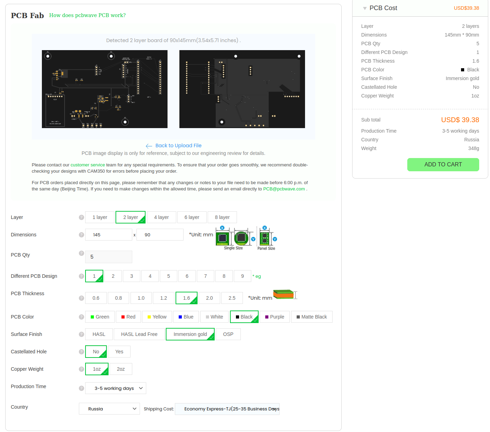
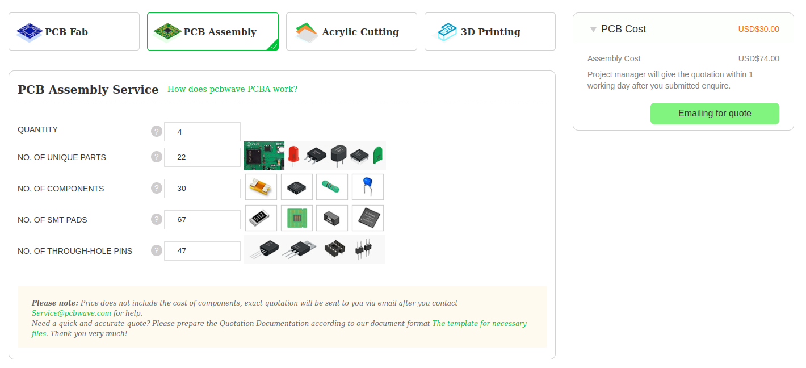
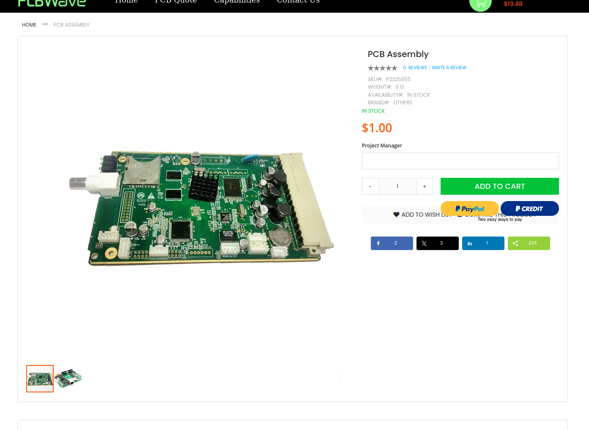
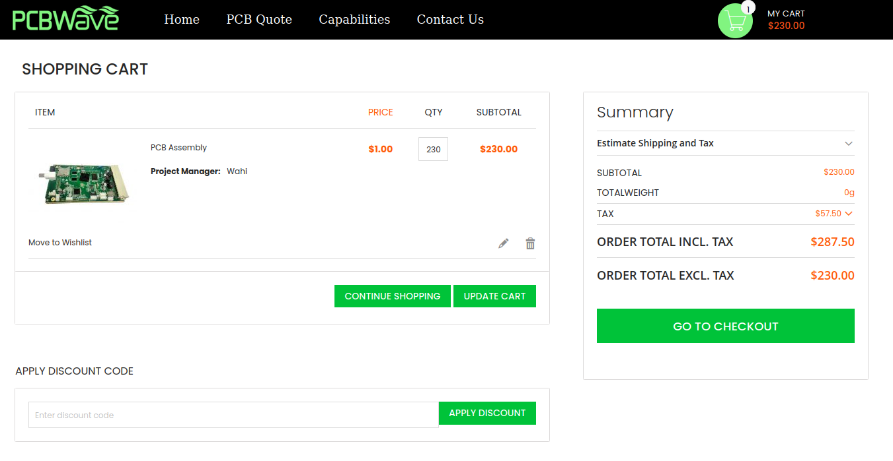
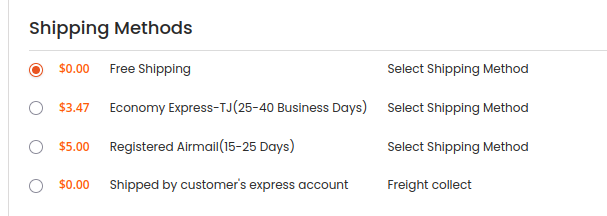
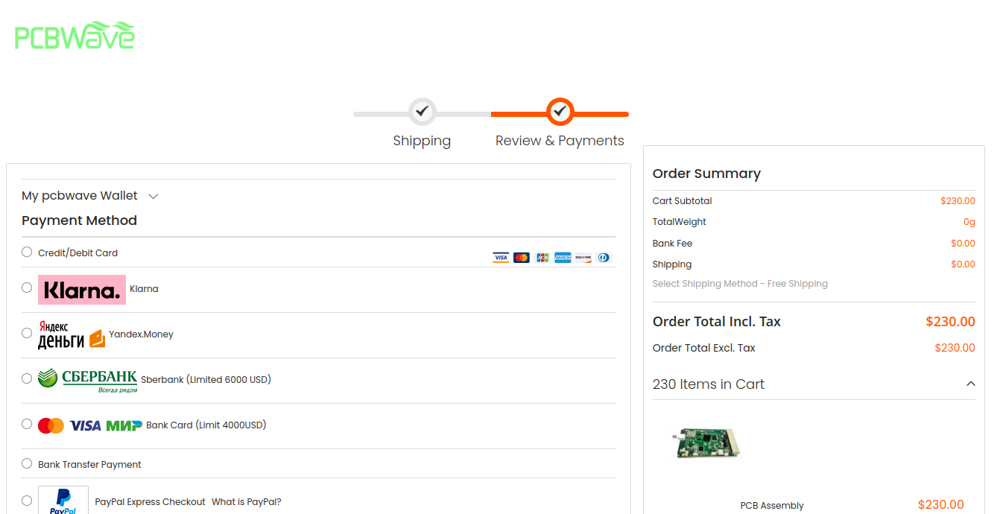
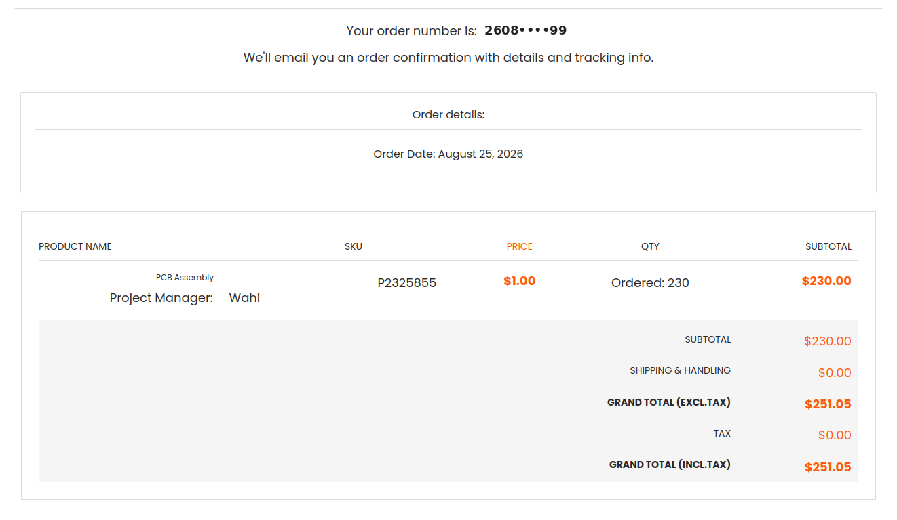

# Как я отправил свою плату на завод: от Gerber до оплаты первой партии PCBA

В прошлой части я остановился на моменте, когда плата **ESP32-E220-Carrier-Rev1** наконец перестала меняться каждый вечер, прошла проверки, а из KiCad получился нормальный производственный пакет.

Но есть одна неприятная особенность проектирования электроники: пока файл лежит у тебя на диске, он может быть идеальным сколько угодно.

Настоящая проверка начинается, когда этот файл отправляется на завод.

Поэтому следующий этап у проекта был довольно прозаичный: выбрать производителя, объяснить ему, что именно я хочу получить, пережить вопросы по компонентам, согласовать замены и в конце концов нажать кнопку оплаты.

В итоге заказ ушёл в PCBWAVE: **5 печатных плат, из них 4 с полной заводской сборкой**. Пятая останется голой — на случай экспериментов, ремонта, проверки посадочных мест или если мне внезапно захочется что-нибудь допаять руками.

И вот процесс заказа оказался интереснее, чем я ожидал.

## Сначала — просто посчитать голые платы

Первым делом я загрузил Gerber-файлы в обычный калькулятор PCBWAVE.

Сайт сам распознал:

**2 слоя, 145×90 мм, одна конструкция платы.**

Дальше выставил то, что мы уже зафиксировали при проектировании: FR-4, толщина 1,6 мм, медь 1 oz, пять экземпляров, без металлизированных вырезов по краю.

Отдельно хотелось чёрную маску. Не потому что она как-то улучшает электрические характеристики. Просто если уж несколько недель мучить плату вместе с нейросетями, пусть хотя бы выглядит красиво :)

Сначала я поставил иммерсионное золото.

Пять плат получались примерно в **$39,38**.

Потом переключил покрытие на **HASL Lead Free** — бессвинцовое выравнивание горячим воздухом.

Цена сразу упала до **$19,48**.

То есть иммерсионное золото добавляло примерно двадцать долларов практически на ровном месте. Для серийного изделия или платы с очень мелким шагом я бы ещё подумал, но для первой ревизии смысла переплачивать не увидел.

Чёрная маска при этом цену не изменила.

На ней и остановился: **чёрная плата, белая маркировка, HASL Lead Free**.

## А потом оказалось, что «цена платы» — это самая простая часть

У PCBWAVE есть отдельный калькулятор сборки.

Я указал четыре собираемых платы, примерно посчитал количество типов компонентов, самих деталей, контактных площадок поверхностного монтажа и выводов компонентов, которые паяются в отверстия.

На этом этапе сайт показывал около **$74 за сборку**.

Выглядит приятно.

Но прямо под формой написано главное: **стоимость компонентов сюда не входит, точный расчёт делается менеджером по запросу**.

То есть веб-калькулятор в случае PCBA — это скорее способ понять порядок цифр. Реальная работа начинается после письма.

И это, кстати, важный момент. В предварительную форму я вводил **22 типа компонентов, 30 деталей, 67 площадок поверхностного монтажа и 47 выводов в отверстия**. В финальном расчёте завода получилось уже **25 типов компонентов, те же 30 устанавливаемых деталей, 66 площадок поверхностного монтажа и 47 выводов**.

Ничего страшного тут нет. Просто завод пересчитал всё по своей логике и по реальной спецификации, а не по моей прикидке в форме.

## Самое важное — не Gerber, а объяснить заводу, что именно надо собирать

У этой платы есть особенность: это **плата-носитель**.

ESP32 DevKit, E220 и OLED завод устанавливать не должен. Я вставлю их сам после получения.

А вот женские разъёмы под них, наоборот, должны быть установлены на заводе.

Если просто отправить спецификацию без пояснений, тут очень легко получить не то, что задумывалось.

Поэтому к запросу ушёл отдельный пакет для расчёта. В нём были Gerber-файлы, спецификация компонентов, файл координат установки, список компонентов, которые паяются в отверстия, перечень того, что устанавливать не нужно, сборочные примечания и чертежи.

Особенно подробно расписал несколько вещей:

J1/J2 — завод припаивает две 15-контактные розетки Samtec под ESP32.  
J3 — завод припаивает розетку под E220.  
J5 — завод припаивает розетку под OLED.  
Сами ESP32, E220 и OLED **не поставляются и не устанавливаются**.

J6 и J9 — это просто металлизированные отверстия для будущих проводов. Никаких гребёнок туда ставить не надо.

TP1…TP5 — тоже только отверстия для щупа. Никаких штырей.

R10 и R11 вообще не имеют посадочных мест на плате и оставлены как опциональные элементы в документации.

Три отверстия H1/H2/H3 — обычные 3,2-миллиметровые неметаллизированные крепёжные отверстия.

Звучит как занудство. Но лучше один раз написать пять лишних строк в письме, чем потом получить четыре аккуратно собранные платы с четырьмя аккуратно припаянными лишними разъёмами.

## И тут снова пригодился ИИ

На этапе проектирования ИИ в основном спорил со мной про разводку, питание, зоны земли и посадочные места.

На этапе заказа его роль неожиданно изменилась.

Сначала мы действительно подготовили пакет для запроса цены: заполнили шаблон PCBWAVE исходными данными из нашей спецификации, приложили Gerber, координаты установки, список выводных компонентов, список того, что устанавливать не надо, и сборочные примечания.

Но это была именно **исходная заявка на расчёт**, а не таблица согласованных замен.

Самое интересное началось уже после того, как PCBWAVE вернул свой расчёт.

В присланной ими таблице появилась отдельная колонка с комментариями завода. По части строк они прямо написали: вот такой MPN мы реально можем поставить, пожалуйста, подтвердите. А по L1 сначала вообще стояло **NO STOCK**.

В письме менеджер отдельно объяснил, что позиции с отметкой `N` означают замену на компонент другого производителя с теми же основными параметрами, попросил проверить выделенные строки и подтвердить предложенные MPN.

Вот тут ChatGPT пригодился уже совсем в другой роли.

Я отдавал ему присланную PCBWAVE таблицу, а мы построчно сравнивали её с исходной спецификацией: что является обычным вариантом исполнения той же детали, где изменился только заказной суффикс, где допустим любой нормальный резистор нужного номинала и допуска, а где нам действительно предлагают другой компонент и надо лезть в документацию производителя.

То есть решение о заменах появлялось не у нас заранее. **Завод сначала сообщил, что реально может купить, а мы уже проверяли и либо подтверждали, либо просили другой вариант.**

И это оказалось не менее полезно, чем помощь с самой схемой. На этом этапе ИИ был уже не столько «электронщиком», сколько техническим закупщиком и очень придирчивым вторым проверяющим переписки с производством.

## Первый нормальный расчёт от завода

Запрос отправил 21 августа.

Менеджера зовут Wahi. Он сразу написал, что занимается проектами для российских заказчиков, и пообещал прислать расчёт после выходных.

24 августа пришла первая полноценная смета, а 25-го — уточнённая.

Финальная разбивка получилась такая:

| Что | Цена |
| --- | ---: |
| 5 печатных плат | $19,48 |
| Трафарет | $12,00 |
| Сборка 4 плат | $80,00 |
| Компоненты для 4 плат | $109,92 |
| Доставка | $8,74 |
| **Итого по расчёту** | **$230,14** |

Прошивку и функциональное тестирование я не заказывал — в смете там стоит ноль. Логично: ESP32 и E220 всё равно приедут отдельно и будут вставляться уже мной.

По доставке в расчёте указан **Commercial Express-TJ**, масса около 0,8 кг и ориентир **1–2 месяца**. По переписке изготовление после подтверждения заказа оценили примерно в три недели.

То есть быстро эта история не закончится.

Но после нескольких недель проектирования ожидание посылки уже кажется самой простой частью :)

## Компоненты: где начинается самое интересное

Вот здесь реальный процесс особенно хорошо отличается от красивой схемы «отправил BOM — завод всё купил».

В первой присланной PCBWAVE таблице было несколько строк, которые они попросили подтвердить.

Для предохранителя F1 вместо базового `1812L200/16` они указали конкретный вариант `1812L200/16DR`.

Для двух разъёмов питания J4/J8 вместо короткого обозначения `B2B-XH-A` — полный заказной вариант `B2B-XH-A(LF)(SN)`.

Для преобразователя U1 вместо `TPS62133RGT` — `TPS62133RGTR`.

Это как раз те случаи, где нельзя пугаться каждого дополнительного символа в MPN, но и нельзя просто махнуть рукой. Мы проверили, что речь идёт о подходящих вариантах тех же компонентов, и подтвердили их.

С обычными резисторами всё было ещё проще. Для R1, R2, R8 и R9 в исходной спецификации и так было разрешено использовать качественные аналоги 0603 с нужным номиналом и допуском. PCBWAVE отдельно уточнил этот момент, а потом написал, что закупит резисторы с требуемыми параметрами.

А вот с катушкой L1 история была уже настоящей заменой.

В проекте стояла **Coilcraft XFL4020-222MEB, 2,2 мкГн**. В первой смете напротив неё завод написал просто:

**NO STOCK.**

То есть сначала никакой замены ещё не было — деталь просто выпала из расчёта.

После нашей переписки инженеры PCBWAVE предложили другой конкретный MPN:

**XGL4020-222MEC.**

Вот такую замену я уже не хотел подтверждать по принципу «ну почти одинаковое название».

Мы отдельно сравнили параметры и документацию Coilcraft. В итоге XGL4020 действительно оказался подходящей заменой для нашего преобразователя, причём по части токовых характеристик даже с большим запасом.

Только после этого я написал Wahi, что **XGL4020-222MEC для L1 согласован**.

После подтверждения они обновили таблицу и пересчитали стоимость компонентов.

Мне вообще нравится эта часть процесса. Ты вроде уже закончил проектировать плату, но проектирование на самом деле не заканчивается. Просто теперь новые инженерные решения начинают приходить с другой стороны — со склада и от закупщиков производителя.

## Как оплачивается индивидуальный заказ на $230 через товар стоимостью $1

После всех подтверждений Wahi написал примерно следующее:

стоимость обновлённого заказа — **$230,14**, а для оплаты надо открыть специальную позицию `PCB Assembly` стоимостью **$1** и купить **230 штук**.

Звучит великолепно.

Но на самом деле всё логично: это просто универсальная платёжная позиция для индивидуальных расчётов.

В поле `Project Manager` я указал **Wahi**, количество поставил **230**.

В корзине получилось ровно **$230**.

Правда, сайт сначала решил немного добавить драматизма и показал предварительный налог $57,50 — итог превратился в $287,50.

После перехода к оформлению и выбора страны всё вернулось к нормальной жизни.

Менеджер отдельно попросил выбрать **Free Shipping**, потому что $8,74 доставки уже сидят внутри согласованной суммы.

На странице оплаты итог снова был **$230**, без налога и без отдельной стоимости доставки.

Причём для российского заказа сайт предлагает вполне знакомые варианты оплаты, включая Сбербанк и карты «Мир».

Оплату провёл через Сбербанк.

## И последний маленький квест от сайта

После оплаты заказ создался, менеджер указан правильно, количество — 230 условных единиц.

Но здесь есть странность, которую я пока не буду изображать понятной.

В строке товара остаётся **$230,00**, доставка — $0, налог — $0, а `Grand Total` в подтверждении почему-то показывает **$251,05**.

По самому экрану не видно, откуда взялись дополнительные $21,05. Возможно, это особенность конкретного способа оплаты или комиссии платёжного шлюза, но гадать не хочу.

Для истории проекта фиксирую как есть: согласованный расчёт PCBWAVE — **$230,14**, платёжная позиция на сайте — **$230**, а финальное подтверждение заказа показывает **$251,05**. Если выяснится точная причина, потом допишу.

Мне такой вариант нравится больше, чем делать вид, будто я понял логику чужого интернет-магазина :)

## Что в итоге заказано

На текущий момент оплачено производство **пяти ESP32-E220-Carrier-Rev1**.

Четыре платы должны прийти полностью собранными в части компонентов самой платы-носителя. Пятая — без сборки.

ESP32 DevKit, E220 и OLED я установлю сам.

После оплаты PCBWAVE попросил прислать номер заказа менеджеру, чтобы он связал платёж с нашей перепиской.

Номер отправил. Через некоторое время Wahi подтвердил, что платёж получен, и написал, что заказ запускают в производство.

То есть на этом месте уже можно поставить нормальную точку: **проект оплачен и передан в производство**.

Теперь остаётся ждать инженерную проверку, закупку компонентов, изготовление и сборку.

И я почти уверен, что до момента отправки завод ещё хотя бы раз задаст какой-нибудь вопрос. Если задаст — это даже хорошо. Гораздо приятнее получить письмо «уточните вот этот компонент», чем потом разглядывать четыре одинаково неправильно собранные платы.

## Что я понял после первого заказа PCBA

Главное открытие: заказать сборку платы — это не «загрузить Gerber и заплатить».

Gerber описывает только саму плату. Для нормальной сборки заводу надо ещё однозначно понять, **что поставить, что не поставить, какой компонент допустимо заменить, что является пользовательским разъёмом, что является просто отверстием и какие части устройства вообще не входят в сборку**.

И вот здесь вся предыдущая педантичность с производственным пакетом внезапно окупилась.

Когда завод спросил про замену L1, мне не пришлось вспоминать, почему там вообще стоит именно эта катушка. Когда менеджер пересчитал количество деталей, было с чем сравнить. Когда надо было объяснить J6, J9 и контрольные точки — уже существовал отдельный список того, что завод не должен устанавливать.

Наверное, именно в этот момент проект окончательно перестал быть «платой, которую мы нарисовали с нейросетями» и стал обычным инженерным изделием со спецификацией, закупкой, производством и логистикой.

А следующий пост, надеюсь, уже будет с фотографиями настоящих чёрных плат.

И вот там мы наконец узнаем главное:

**работает ли всё это в реальном мире.**
